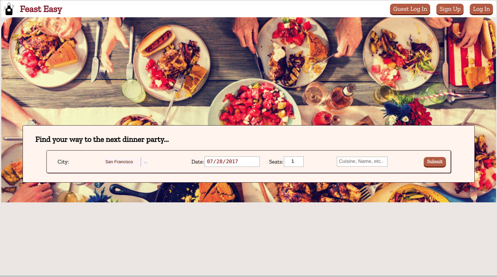
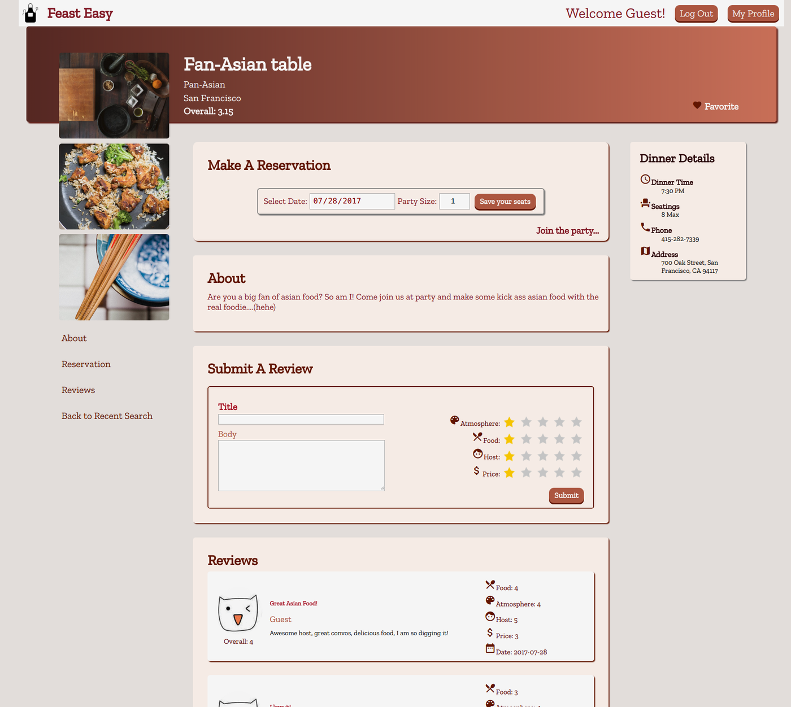
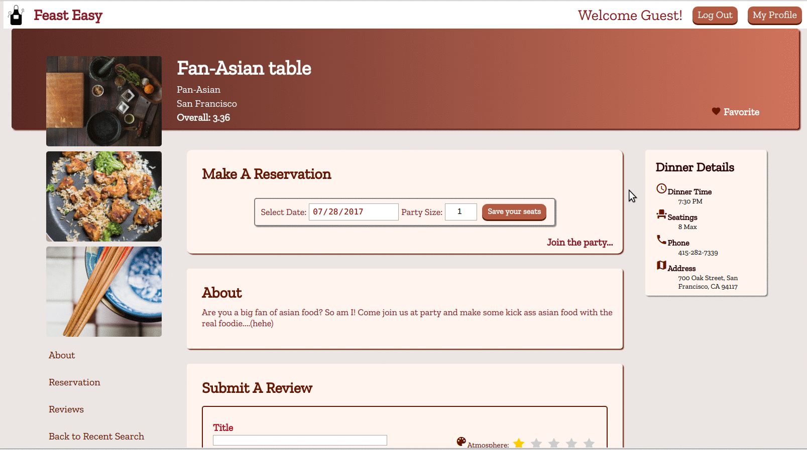

# README

# **FeastEasy**  

[Live link](https://feasteasy.herokuapp.com)  


## **Introduction**  

+ FeastEasy is a web application where you can search for any "Private Kitchens" that offers dinner parties in cities in the United States and globally. The idea is to find the equivalent of a Speak-Easy for dinner parties wherever you visit!

### **The Product**  

FeastEasy is a web application inspired by OpenTable, AirBnb and Couchsurfing built using React.js with Redux on the frontend and Ruby on Rails with a PostgreSQL database on the backend. This app implements the following functionality:

### **Design Docs**  
+ [View Wireframes](.docs/wireframes/)  

### **Features**

+ Search for kitchens based on reservations availability
+ User profile page that list favorites and past reviews and picture uploading feature
+ Create reservations
+ Add ratings / reviews
+ Add favorites


### **User Authentification**  



+ The app features log in and sign up components as modals. The login form simply creates a POST request for a new session. The application's private components, such as the user account page and kitchen detail pages, are protected via backend and frontend authentification. A guest login is provided at the app header and also in individual login/sign up modal forms. It creates a seamless user experience for new site visitors. It's recommended to log in using the demo to experience all the functionalities of the app.

### **Interactive User-Experience Design: Favorites, Review and Ratings**



+ Inside the kitchen show page header features a heart-shaped "Favorites" button, which is dynamically toggled on or off when clicked and updates kitchen's and user's favorites relationship. This toggling is enabled via JavaScript inside a React component responsible for the favoriting functionality. The button is rendered based on whether the user has favorited the kitchen and will re-render when the button is in action. The favorited listing is also shown on the user's profile page whenever the component is mounted, which retrieved the current user's data to be displayed.

``` JavaScript
class FavoriteButton extends React.Component {
  constructor (props) {
    super(props);
    this.state = {
      favorite: {
        kitchen_id: this.props.match.params.kitchenId,
        user_id: this.props.currentUser.id,
      },
      favorited: this.initialState(),
    };
    this.handleSubmit = this.handleSubmit.bind(this);
    this.initialState = this.initialState.bind(this);
  }

  initialState (){
    if (this.props.kitchen.favorite_id.includes(this.props.currentUser.id)) {
      return true;
    } else {
      return false;
    }
  }

  handleSubmit (e) {
    e.preventDefault();
    if (this.state.favorited === false) {
      this.props.createFavorite(this.state.favorite).then(() => {
        this.setState({favorited: true});
      });
    } else {
      this.props.removeFavorite(this.props.match.params.kitchenId, this.props.currentUser.id).then(() => {
        this.setState({favorited: false});
      });
    }
  }
```



+ Users can interact with kitchens by favoriting, reviewing and rating the kitchens. Each kitchen show page contains a section to review and rate the kitchen, and view other users' reviews and ratings. The review form is set up with star rating systems where the user can rate the experience in a simple yet fun way. When the review form is submitted, an action dispatches an AJAX POST request to the Rails reviews controller. On success, the new review is rendered on the page with a dynamic cat-emoticon image based on the overall rating of the review.  


### **Kitchens search based on reservations availability**  


+ The kitchen search bar is the main feature on the front/landing page.
Users have the option to choose a city from a drop down menu, a date and number of seats wanted in the reservation. The optional input field can take any extra search query strings. The experience is built so users can specifically find kitchens with featured cuisines, dishes and also casually browse the available kitchens from the selected city.

+ When the user click the submit button, the search query is saved in the history params and also in the search slice of state to retain the information on the result's page where users can see what the search was. The history params also allows the user to re-fresh the page and retain the search results. Users then can browse the individual kitchens with not just the kitchen's info, but also the latest review of the kitchen.

+ They can then click into the kitchen's show page where users can also go back to the search results page using the anchor links on the left hand side below the kitchen pictures. For a better user experience, the search params are retained in the reservation box where the user can now immediately make a reservation. The reservation-request functionality performs the logic in the back end where it will return a modal message to confirm whether the user had successfully made the reservation or not.

``` JavaScript
class SearchForm extends React.Component {
  constructor (props) {
    super(props);
    this.state = {
      city_id: "",
      size: "1",
      date: (new Date()).toISOString().slice(0, 10),
      search_string:""
    };
    this.handleSubmit = this.handleSubmit.bind(this);
    this.renderErrors = this.renderErrors.bind(this);
    this.updateState = this.updateState.bind(this);
    this.getSearch = this.getSearch.bind(this);

  }

  getSearch () {
    const query = qs.parse(this.props.location.search);
    return ({
      city_id: query["cityId"],
      size: query["size"],
      date: query["date"],
      search_string: query["searchString"]
    });
  }

 componentDidMount() {
  this.props.fetchCities();
  this.props.sendSearch(this.getSearch());
  this.setState(this.getSearch());

  handleSubmit(e) {
    e.preventDefault();
    let string = this.state.search_string || "";
    this.props.sendSearch(this.state);
    this.props.fetchKitchens(this.state);
    const params = {
      cityId: this.state.city_id,
      size: this.state.size,
      date: this.state.date,
      searchString: string
    };
    const psearch = qs.stringify(params);
    this.props.history.push(`/searchResults?${psearch}`);
  }

}
```

### **User Account Page**  


+  The user account page is accessible by clicking the "My Profile" button on the top right hand corner when the user is logged in (protected route). On the left hand side, it renders either a picture uploading form if the user desire the upload a profile picture or the picture of the user if the picture already exists.

+ The picture uploading feature is done using Cloudinary API and a few other dependencies like react-dropzone(to accept the image using drag-drop) and superagent (transferring the uploaded image).

+ The user account page also features click-able favorited kitchen boxes for the user and also any past reviews that the user has created.


 ### **Future Planned Feature Implementations**
 + List of featured hosts(users) on the front page for exploration
 + Create and Edit Kitchen listing with managerial properties
 + Add more details to user profiles for users' exploration
 + Add Google map API to assist search based on location
 + Create tagging systems to label kitchens
